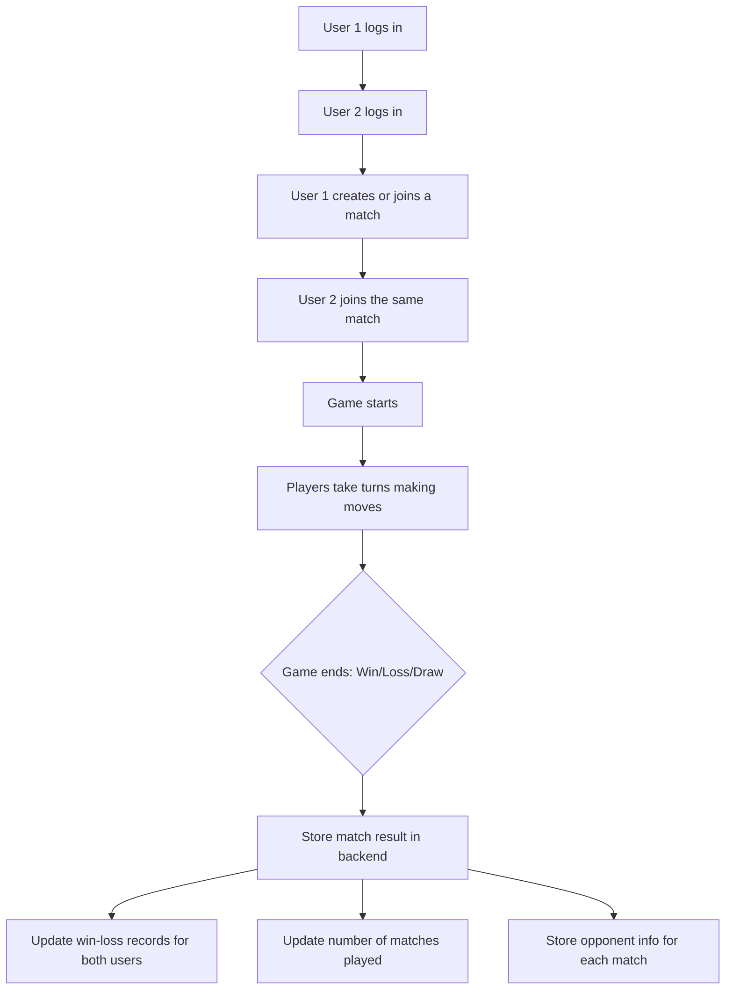

## Multiplayer Tic Tac Toe: User-vs-User Flow

## Backend Data Storage Ideas

- **Win-Loss Records:**  
  Each user will have a record of wins, losses, and draws, updated after every match.

- **Number of Matches Played:**  
  Track the total matches each user has played.

- **Match Details:**  
  For every match, store:
  - Usernames of both players
  - Outcome (win/loss/draw for each)
  - Date/time of match
  - Moves played (optional for analytics)
  - Opponent info (who played against whom)

- **Example Data Structure:**
  - User:
    - username
    - wins
    - losses
    - draws
    - matches_played
  - Match:
    - match_id
    - player1
    - player2
    - winner
    - loser
    - draw (boolean)
    - timestamp
    - moves (optional)

## Additional Backend Data Storage Ideas

- **Move Timing:**  
  Store timestamps for each move to analyze speed and decision-making.

- **Streaks:**  
  Track current and longest win/loss/draw streaks for each user.

- **Leaderboard Data:**  
  Aggregate stats for ranking users (e.g., win rate, total points).

- **Match Status:**  
  Store whether a match is active, completed, or abandoned.

- **Rematch History:**  
  Track if users have played multiple matches against each other.

- **Chat Logs:**  
  If in-game chat is supported, store chat history for moderation.

- **User Preferences:**  
  Save settings like preferred board theme or notifications.

- **Achievement/Badge Tracking:**  
  Record progress toward milestones (e.g., 10 wins, first draw).

- **Device/Platform Info:**  
  Optionally log device type or browser for troubleshooting.

## Administration and Moderation

- **Moderator Roles:**  
  Moderators can review match histories, chat logs, and user reports to help maintain a safe and fair environment.

- **Preventing Abuse:**  
  Moderators may take actions such as warning, muting, or banning users who violate rules (e.g., inappropriate language, cheating).

- **Automated Tools:**  
  Backend systems can flag suspicious behavior or language for moderator review.

- **Data Access:**  
  Moderators have access to relevant backend data (e.g., chat logs, match outcomes) to investigate and resolve issues.